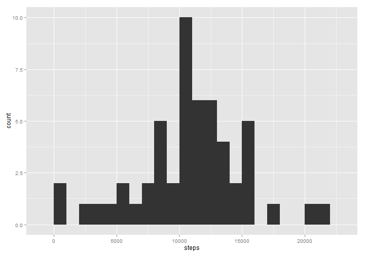
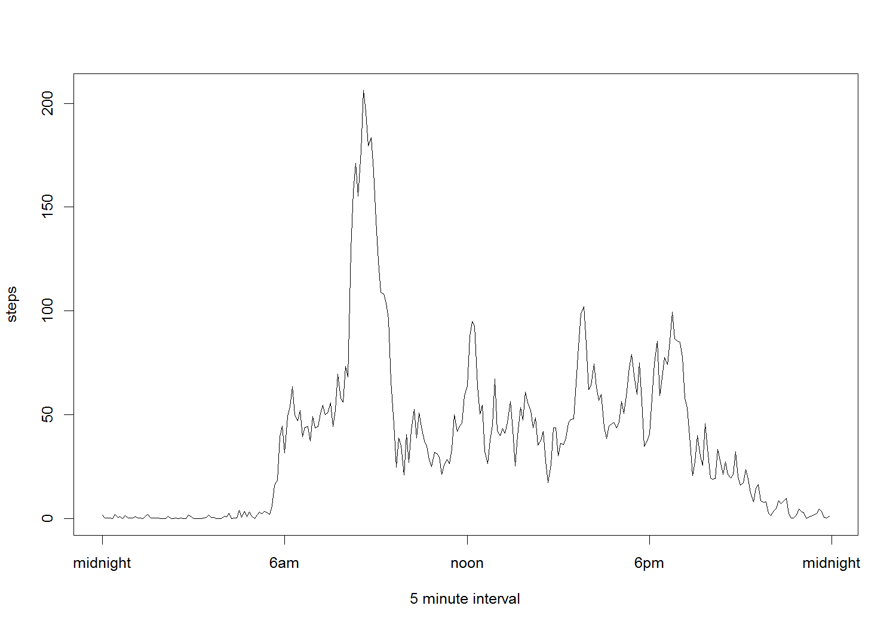
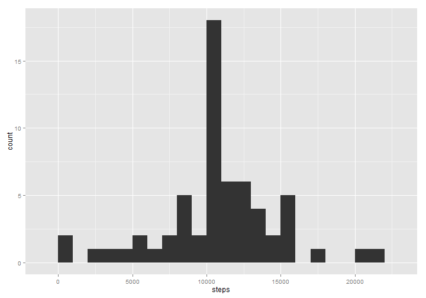
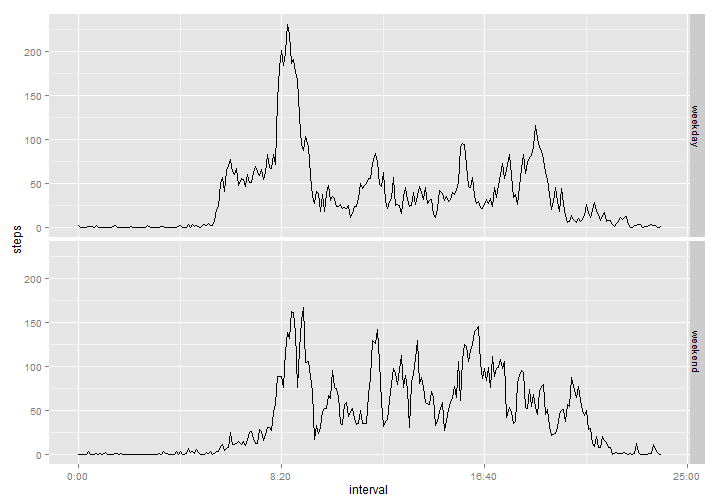

Loading libraries that will be used later. The rubric specifically says to show all code, so echo will be left on.

```r
require(dplyr)
```

```
## Loading required package: dplyr
## 
## Attaching package: 'dplyr'
## 
## The following object is masked from 'package:stats':
## 
##     filter
## 
## The following objects are masked from 'package:base':
## 
##     intersect, setdiff, setequal, union
```

```r
require(ggplot2)
```

```
## Loading required package: ggplot2
```

## Loading and preprocessing the data
The file in the initial fork is in a zip archive in the current working directory. Extract and read it in.

Look at the structure of the data to get a feel for the preprocessing required.


```r
data<-read.csv(unz("./activity.zip","activity.csv"))
str(data)
```

```
## 'data.frame':	17568 obs. of  3 variables:
##  $ steps   : int  NA NA NA NA NA NA NA NA NA NA ...
##  $ date    : Factor w/ 61 levels "2012-10-01","2012-10-02",..: 1 1 1 1 1 1 1 1 1 1 ...
##  $ interval: int  0 5 10 15 20 25 30 35 40 45 ...
```
The interval column is an integer, with the hundreds representing the hour. This could be changed to a factor in the format hh:mm by the following code. 


```r
# data$interval<-as.factor(sprintf("%02d:%02d",
#                                  data$interval%/%100, 
#                                  data$interval%%100))
# class(data$interval)
# head(data,12)
```
however this spoils the look of the time series plot, which would no longer have a line. With no change, the line would appear continuous, but in fact there would be jumps of 40 minutes every hour. So instead it is converted to minutes as follows:

```r
data$interval<-data$interval%/%100*60+data$interval%%100
class(data$interval)
```

```
## [1] "numeric"
```

```r
data[10:20,]
```

```
##    steps       date interval
## 10    NA 2012-10-01       45
## 11    NA 2012-10-01       50
## 12    NA 2012-10-01       55
## 13    NA 2012-10-01       60
## 14    NA 2012-10-01       65
## 15    NA 2012-10-01       70
## 16    NA 2012-10-01       75
## 17    NA 2012-10-01       80
## 18    NA 2012-10-01       85
## 19    NA 2012-10-01       90
## 20    NA 2012-10-01       95
```
## What is mean total number of steps taken per day?
Summarise the data by day and produce a histogram of the total steps (with bin width of 1000).

```r
daily_data<-data %>% group_by(date) %>% summarise(steps=sum(steps))
ggplot(daily_data, aes(x=steps)) + geom_histogram(binwidth = 1000)
```

 


NA values are ignored in calculating the mean and median.

```r
mean_total_steps_per_day<-mean(daily_data$steps,na.rm=TRUE)
mean_total_steps_per_day
```

```
## [1] 10766.19
```

```r
median_total_steps_per_day<-median(daily_data$steps,na.rm=TRUE)
median_total_steps_per_day
```

```
## [1] 10765
```
The mean total number of steps per days is calculated as 10766.188679 whereas the median is 10765.000000.

## What is the average daily activity pattern?

To make a time series plot (i.e. type = "l") of the 5-minute interval (x-axis) and the average number of steps taken, averaged across all days (y-axis), the data is summarised by intervals.

```r
interval_data<-data %>% group_by(interval) %>% summarise(steps=mean(steps,na.rm=TRUE))
plot(interval_data,type="l",xlab="5 minute interval",xaxt = "n")
axis(1, at = c(0, 6*60, 12*60, 18*60,24*60),labels=c("midnight", "6am","noon", "6pm","midnight"))
```

 


The 5-minute interval, on average across all the days in the dataset, containing the maximum number of steps can be determined by sorting the interval dataset by steps decreasing and looking at the top one (amongst other methods):

```r
top_interval<-arrange(interval_data,desc(steps))[1,1]
top_interval
```

```
## Source: local data frame [1 x 1]
## 
##   interval
## 1      515
```
So the top interval starts at 515 minutes, in other words from 8:35 to 8:40.

## Imputing missing values
To determine the number of missing values, create a logical vector and count them by creating the sum, since the TRUE values are 1, and the false ones are 0.

```r
missing<-is.na(data$steps)
sum(missing)
```

```
## [1] 2304
```
This shows 2304 intervals have no recorded steps.

Creating a new dataset with the NA values replaced with the median across all days of the interval can be achieved by
        * adding this value to the dataframe using a join to the previously created interval_data summary table
        * copying this value to the steps field for all rows with an NA steps value


```r
imputed_data<-inner_join(data,interval_data,by=c("interval"="interval"))
imputed_data[missing,1]<-imputed_data[missing,4]
# Now drop the extra column and rename the first back to steps
imputed_data[,4]<-NULL
colnames(imputed_data)[1]<-"steps"
# show there are no more NA values
str(imputed_data)
```

```
## 'data.frame':	17568 obs. of  3 variables:
##  $ steps   : num  1.717 0.3396 0.1321 0.1509 0.0755 ...
##  $ date    : Factor w/ 61 levels "2012-10-01","2012-10-02",..: 1 1 1 1 1 1 1 1 1 1 ...
##  $ interval: num  0 5 10 15 20 25 30 35 40 45 ...
```

Repeat the previous steps to summarise the imputed data by day and produce a histogram of the total steps (with bin width of 1000).

```r
daily_data<-imputed_data %>% group_by(date) %>% summarise(steps=sum(steps))
ggplot(daily_data, aes(x=steps)) + geom_histogram(binwidth = 1000)
```

 


```r
imputed_mean_total_steps_per_day<-mean(daily_data$steps)
imputed_mean_total_steps_per_day
```

```
## [1] 10766.19
```

```r
imputed_median_total_steps_per_day<-median(daily_data$steps)
imputed_median_total_steps_per_day
```

```
## [1] 10766.19
```
The mean total number of steps per days is calculated as 10766.188679 whereas the median is 10766.188679.

The difference in means after imputation is 0.000000, and in medians is 1.188679.

Interestingly, this particular choice of imputation style has led to the mean and median being the same. That the mean was not modified is not so surprising.


## Are there differences in activity patterns between weekdays and weekends?

Creating a new factor variable in the dataset with two levels ‚<U+0080><U+0093> ‚<U+0080><U+009C>weekday‚<U+0080>ù and ‚<U+0080><U+009C>weekend‚<U+0080>ù indicating whether a given date is a weekday or weekend day, then grouping by this field and the interval, summarising the average steps across all days.


```r
week_data<-imputed_data %>% 
        mutate(daytype = as.factor(
                ifelse(weekdays(as.Date(date)) == "Saturday" | 
                       weekdays(as.Date(date)) == "Sunday",
                       "weekend","weekday"))) %>% 
        group_by(daytype, interval) %>%
        summarise(steps=mean(steps))
```

Using ggplot to create a panel plot similar to the reference one in the original readme for this assignment.

```r
timeHM_formatter <- function(x) {
    h <- floor(x/60)
    m <- floor(x %% 60)
    lab <- sprintf('%02d:%02d', h, m) # Format the strings as HH:MM
    lab <- gsub('^0', '', lab)        # Remove leading 0 if present
}


ggplot(week_data, aes(x = interval, y = steps, group = daytype)) +
        geom_line() +
        scale_x_continuous(label=timeHM_formatter) +
        facet_grid(daytype~.)
```

 
The plot shows a significantly lower spike during weekends in the number of steps taken around 8:30 am, and slightly increased activity over the rest of the day. 
